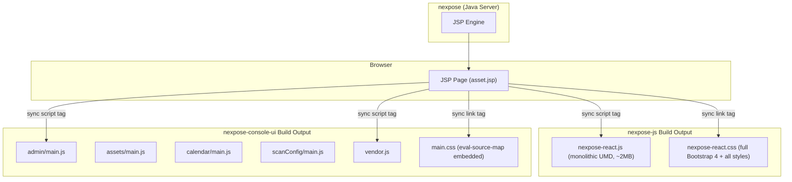
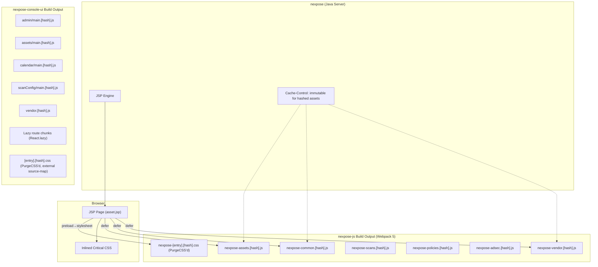

# Design Document: Lighthouse Performance Optimization

## Overview

This design addresses the Lighthouse performance score of 31/100 on the Scan Manager UI's `asset.jsp` page by implementing targeted optimizations across the nexpose-js, nexpose-console-ui, and nexpose (JSP/server) repositories. The optimizations are organized into four tiers: render-blocking elimination, font delivery fixes, build tooling modernization (Webpack 5 upgrade, IE 11 removal, source map fix), and structural changes (code splitting, lazy loading, CSS purging, cache headers). An automated Lighthouse CI pipeline ensures regressions are caught before production.

The architecture spans a Java/JSP backend (`nexpose`) that serves HTML pages referencing bundles from three frontend repos:
- **nexpose-js**: Webpack 4 + Grunt, React 17, single monolithic UMD bundle, IE 11 targeting
- **nexpose-console-ui**: Webpack 5 + esbuild-loader, React 18, multi-entry builds, Recoil state
- **nexpose-policy-js** / **adaptive-security-js**: Webpack 1, React 16.x, single UMD bundles consumed as npm dependencies by nexpose-js

The design preserves functional equivalence — every existing route, component, and user interaction must work identically after optimization. Changes are scoped to build configuration, asset loading patterns, and CSS delivery; no application logic is modified.

## Architecture

### Current Architecture



### Target Architecture



### Key Architectural Decisions

1. **Webpack 5 upgrade for nexpose-js before code splitting** — Webpack 4's `splitChunks` is less capable and doesn't support `[contenthash]` as reliably. Upgrading first enables all downstream optimizations (Req 10).

2. **Multi-entry code splitting over dynamic imports for nexpose-js** — Since nexpose-js routes are loaded by separate JSP pages (not a client-side router), multi-entry with `splitChunks` is the correct pattern. Each JSP page includes only the chunks it needs.

3. **React.lazy() for nexpose-console-ui routes** — nexpose-console-ui uses React Router 6 with a client-side router, making dynamic `import()` with `React.lazy()` the natural code-splitting mechanism.

4. **PostCSS plugin for font-display injection** — Third-party npm font packages (roboto-fontface, rapid7-muli-font) don't include `font-display: swap`. A PostCSS plugin that injects it into all `@font-face` rules is more maintainable than forking packages or maintaining SCSS overrides.

5. **PurgeCSS as Webpack plugin** — Integrated into the build pipeline rather than as a separate step, ensuring CSS purging happens automatically on every production build.

6. **Conditional devtool in nexpose-console-ui** — The `devtool` setting is currently hardcoded to `eval-source-map` for all modes. Making it conditional on `mode` is a one-line change with significant production impact.

## Components and Interfaces

### Component 1: JSP Script Loader (nexpose repo)

**Responsibility:** Controls how `<script>` and `<link>` tags are emitted in JSP templates.

**Changes:**
- Add `defer` attribute to all `<script>` tags loading nexpose-js and nexpose-console-ui bundles
- Replace synchronous CSS `<link>` tags with the preload pattern:
  ```html
  <link rel="preload" href="styles/nexpose-assets.[hash].css" as="style"
        onload="this.onload=null;this.rel='stylesheet'">
  <noscript><link rel="stylesheet" href="styles/nexpose-assets.[hash].css"></noscript>
  ```
- Inline critical above-the-fold CSS in `<style>` tags in `<head>`
- Add font preload hints:
  ```html
  <link rel="preload" href="/vendor/fonts/roboto/Roboto-Regular.woff2"
        as="font" type="font/woff2" crossorigin>
  ```
- Reference only route-specific chunks instead of the monolithic bundle:
  ```html
  <!-- asset.jsp -->
  <script defer src="scripts/nexpose-vendor.[hash].js"></script>
  <script defer src="scripts/nexpose-common.[hash].js"></script>
  <script defer src="scripts/nexpose-assets.[hash].js"></script>
  ```

**Interfaces:**
- Input: Webpack manifest JSON mapping logical chunk names to hashed filenames
- Output: HTML `<script>` and `<link>` tags in JSP response

### Component 2: nexpose-js Webpack 5 Build Pipeline

**Responsibility:** Replaces the Webpack 4 build with Webpack 5, enabling code splitting, content hashing, and tree-shaking.

**Changes to `webpack.config.js`:**
- Upgrade `webpack` from 4.47.0 to 5.x, `webpack-cli` from 3.x to 4.x
- Replace `webpack-merge` 4.x with 5.x (API change: `merge.smart` → `merge`)
- Replace `file-loader` with Webpack 5 asset modules (`type: 'asset/resource'`)
- Replace `eslint-loader` with `eslint-webpack-plugin`
- Update `mini-css-extract-plugin` to 2.x
- Remove `{ parser: { amd: false } }` (Webpack 5 handles this differently)

**Changes to `webpack.config.prod.js`:**
- Replace single entry `nexpose-react` with multi-entry:
  ```js
  entry: {
    'nexpose-core': './src/js/core.js',
    'nexpose-assets': './src/js/assets.js',
    'nexpose-scans': './src/js/scans.js',
    'nexpose-policies': './src/js/policies.js',
    'nexpose-adsec': './src/js/adsec.js',
  }
  ```
- Add `splitChunks` configuration:
  ```js
  optimization: {
    splitChunks: {
      chunks: 'all',
      cacheGroups: {
        vendor: {
          test: /[\\/]node_modules[\\/]/,
          name: 'nexpose-vendor',
          chunks: 'all',
          priority: 10,
        },
        common: {
          minChunks: 2,
          name: 'nexpose-common',
          chunks: 'all',
          priority: 5,
          reuseExistingChunk: true,
        },
      },
    },
  }
  ```
- Add content hash to output filenames: `filename: '[name].[contenthash].js'`
- Remove UMD library target (no longer a single library export)
- Add `WebpackManifestPlugin` to emit `manifest.json` for JSP consumption

**Changes to `webpack.config.js` (babel):**
- Replace `targets: { ie: 11 }` with `targets: '> 0.5%, not dead, not ie 11'`
- Remove `useBuiltIns: 'entry'` and `corejs` config (polyfills no longer needed for modern targets)

**Changes to `webpack.config.js` (ProvidePlugin):**
- Remove `$: 'jquery'` and `_: 'lodash'` from ProvidePlugin
- Keep `React: 'react'` only if needed by legacy JSX transform (React 17 automatic JSX may eliminate this)

**Changes to `Gruntfile.js`:**
- Update copy tasks to handle multiple chunk files instead of single `nexpose-react.js`
- Use glob patterns to copy `nexpose-*.js` and `nexpose-*.css` from `js/react/dist/`

### Component 3: nexpose-js Font Display Fix

**Responsibility:** Ensures all `@font-face` rules in nexpose-js CSS output include `font-display: swap`.

**Changes:**
- Add `font-display: swap` to the `@font-face` rules in:
  - `css/fonts/_inter-fontface.scss` (2 rules)
  - `css/fonts/_rubik-fontface.scss` (2 rules)
  - `css/fonts/_bootstrap-font-override.scss` (1 rule)
- For `css/fonts/_roboto-fontface.scss` which imports from `roboto-fontface` npm package: add a PostCSS plugin to the build that injects `font-display: swap` into all `@font-face` rules that lack it
- PostCSS plugin implementation (added to `postcss-loader` plugins array):
  ```js
  // postcss-font-display-swap.js
  module.exports = () => ({
    postcssPlugin: 'postcss-font-display-swap',
    AtRule: {
      'font-face': (atRule) => {
        const hasFontDisplay = atRule.nodes.some(
          node => node.prop === 'font-display'
        );
        if (!hasFontDisplay) {
          atRule.append({ prop: 'font-display', value: 'swap' });
        }
      },
    },
  });
  module.exports.postcss = true;
  ```

### Component 4: nexpose-console-ui Build Optimizations

**Responsibility:** Fixes source maps, CSS delivery, font-display, and adds route-level lazy loading.

**Source Map Fix (`webpack/webpackUtils.js`):**
- Change `devtool: 'eval-source-map'` to be conditional:
  ```js
  devtool: isDev ? 'eval-source-map' : 'source-map',
  ```

**CSS Delivery:**
- The current `MiniCssExtractPlugin()` config (no options) produces a single CSS file. Update to use `[name].[contenthash].css` filename pattern:
  ```js
  new MiniCssExtractPlugin({
    filename: '[name].[contenthash].css',
    chunkFilename: '[id].[contenthash].css',
  })
  ```
- Each entry point (admin, assets, calendar, scanConfig) already imports `styles/main.scss` independently, so MiniCssExtractPlugin will naturally produce per-entry CSS files with the filename pattern.

**Font Display Fix:**
- Add the same `postcss-font-display-swap` PostCSS plugin to the nexpose-console-ui sass/css pipeline
- This catches `@font-face` rules from `roboto-fontface` (imported in `main.scss`) and `@rapid7/rapid7-muli-font` (imported in `dev.scss`)
- Add `postcss-loader` to the SCSS rule chain (currently missing — the chain is: `MiniCssExtractPlugin.loader → css-loader → resolve-url-loader → sass-loader`):
  ```js
  {
    test: /\.s[ac]ss$/i,
    use: [
      MiniCssExtractPlugin.loader,
      'css-loader',
      {
        loader: 'postcss-loader',
        options: {
          postcssOptions: {
            plugins: [require('./postcss-font-display-swap')],
          },
        },
      },
      'resolve-url-loader',
      { loader: 'sass-loader', options: { /* existing */ } },
    ],
  }
  ```
- Also add `postcss-loader` to the CSS rule chain for `.css` files (to catch `roboto-fontface.css` and `rapid7-muli-font.css`):
  ```js
  {
    test: /\.css$/i,
    use: [
      MiniCssExtractPlugin.loader,
      'css-loader',
      {
        loader: 'postcss-loader',
        options: {
          postcssOptions: {
            plugins: [require('./postcss-font-display-swap')],
          },
        },
      },
    ],
  }
  ```

**Route-Level Lazy Loading (`routes.tsx`):**
- Replace static imports with `React.lazy()`:
  ```tsx
  const AdminRoutes = lazy(() => import(/* webpackChunkName: "admin-routes" */ 'pages/admin/admin.routes'));
  const AssetsRoutes = lazy(() => import(/* webpackChunkName: "assets-routes" */ 'pages/assets/assets.routes'));
  const CalendarRoutes = lazy(() => import(/* webpackChunkName: "calendar-routes" */ 'pages/calendar/calendar.routes'));
  const SiteConfigRoutes = lazy(() => import(/* webpackChunkName: "siteconfig-routes" */ 'pages/siteConfig/siteConfig.routes'));
  const HomeRoutes = lazy(() => import(/* webpackChunkName: "home-routes" */ 'pages/home/home.routes'));
  ```
- Wrap `<Routes>` in `<Suspense fallback={<LoadingApplicationView />}>` (the `LoadingApplicationView` component already exists and is used in `nav.tsx`)

**Admin Sub-Route Lazy Loading (`admin.routes.tsx`):**
- Replace the 14+ static page imports with `React.lazy()`:
  ```tsx
  const EnginePools = lazy(() => import(/* webpackChunkName: "admin-engine-pools" */ 'pages/enginePools/enginePools'));
  const Blackouts = lazy(() => import(/* webpackChunkName: "admin-blackouts" */ 'pages/blackouts/blackouts'));
  const MultiTenancy = lazy(() => import(/* webpackChunkName: "admin-multitenancy" */ 'pages/multiTenancy/multiTenancy'));
  // ... etc for all sub-pages
  ```
- Each lazy import produces a separate webpack chunk that is only downloaded when the user navigates to that admin sub-route

### Component 5: PurgeCSS Integration

**Responsibility:** Removes unused CSS rules from production builds.

**nexpose-js:**
- Add `@fullhuman/postcss-purgecss` to the PostCSS plugin chain in `webpack.config.js`
- Configuration:
  ```js
  require('@fullhuman/postcss-purgecss')({
    content: [
      './src/js/**/*.{js,jsx}',
      './src/scss/**/*.scss',
      // Include JSP templates that reference CSS classes
    ],
    defaultExtractor: content => content.match(/[\w-/:]+(?<!:)/g) || [],
    safelist: {
      standard: [/^rc-tree/, /^modal/, /^notification/, /^chrome-/, /^dark/, /^light/],
      deep: [/tooltip/, /dropdown/, /popover/],
    },
  })
  ```

**nexpose-console-ui:**
- Add `@fullhuman/postcss-purgecss` to the PostCSS plugin chain:
  ```js
  require('@fullhuman/postcss-purgecss')({
    content: [
      './src/**/*.{ts,tsx}',
      './src/**/*.scss',
    ],
    defaultExtractor: content => content.match(/[\w-/:]+(?<!:)/g) || [],
    safelist: {
      standard: [/^chrome-/, /^ui-dark/, /^ui-light/, /^r7-/, /^rds-/, /^MuiDataGrid/],
      deep: [/tooltip/, /modal/, /notification/],
    },
  })
  ```
- Only apply PurgeCSS in production mode to avoid slowing down dev builds

### Component 6: Cache Header Configuration (nexpose server)

**Responsibility:** Configures HTTP cache headers for optimal browser caching.

**Changes:**
- For hashed assets (`*.[contenthash].js`, `*.[contenthash].css`): `Cache-Control: public, max-age=31536000, immutable`
- For JSP pages and HTML: `Cache-Control: no-cache`
- For font files: `Cache-Control: public, max-age=31536000, immutable` (fonts don't change)
- Implementation via servlet filter or web.xml `<filter>` configuration matching URL patterns

### Component 7: Local Lighthouse Audit Script

**Responsibility:** Provides a local, on-demand script for developers to run Lighthouse audits and track performance metrics over time without CI integration.

**Location:** `nexpose-js/scripts/lighthouse-audit.mjs`

**Dependencies (devDependencies):** `lighthouse`, `chrome-launcher`, `puppeteer-core`

**Script Implementation:**
```js
// scripts/lighthouse-audit.mjs
import lighthouse from 'lighthouse';
import * as chromeLauncher from 'chrome-launcher';
import puppeteer from 'puppeteer-core';
import fs from 'fs';
import path from 'path';

// --- Argument parsing ---
const args = process.argv.slice(2);
const flagArgs = {};
const positionalArgs = [];
for (let i = 0; i < args.length; i++) {
  if (args[i].startsWith('--') && i + 1 < args.length) {
    flagArgs[args[i].replace('--', '')] = args[++i];
  } else if (!args[i].startsWith('--')) {
    positionalArgs.push(args[i]);
  }
}

const DEFAULT_URL = 'https://odin.vuln.lax.rapid7.com:3780/asset.jsp';
const URL = positionalArgs[0] || DEFAULT_URL;
const USERNAME = flagArgs.username || process.env.LH_USERNAME;
const PASSWORD = flagArgs.password || process.env.LH_PASSWORD;
const RESULTS_FILE = path.resolve(process.cwd(), 'lighthouse-results.json');

console.log(`Running Lighthouse audit against: ${URL}`);
if (USERNAME) console.log(`Authenticating as: ${USERNAME}`);
console.log('');

// --- Launch Chrome ---
const chrome = await chromeLauncher.launch({
  chromeFlags: ['--headless', '--no-sandbox', '--ignore-certificate-errors'],
});

let cookies = [];

// --- Authenticate if credentials provided ---
if (USERNAME && PASSWORD) {
  const browserWSEndpoint = `ws://127.0.0.1:${chrome.port}/devtools/browser`;
  // Connect Puppeteer to the Chrome instance launched by chrome-launcher
  const browser = await puppeteer.connect({
    browserWSEndpoint: (await (await fetch(`http://127.0.0.1:${chrome.port}/json/version`)).json()).webSocketDebuggerUrl,
  });

  const page = await browser.newPage();
  // Navigate to login page (derive from target URL)
  const loginUrl = new globalThis.URL(URL);
  loginUrl.pathname = '/login.html';
  await page.goto(loginUrl.toString(), { waitUntil: 'networkidle2' });

  // Fill in credentials and submit
  await page.type('#username, input[name="nexposeccusername"]', USERNAME);
  await page.type('#password, input[name="nexposeccpassword"]', PASSWORD);
  await page.click('button[type="submit"], input[type="submit"], #loginButton');

  // Wait for navigation after login
  await page.waitForNavigation({ waitUntil: 'networkidle2', timeout: 30000 });

  // Extract cookies
  cookies = await page.cookies();
  console.log(`Authenticated successfully. Got ${cookies.length} cookies.`);

  await page.close();
  // Don't disconnect browser — Lighthouse will use the same Chrome instance
}

// --- Run Lighthouse ---
const lighthouseFlags = {
  port: chrome.port,
  output: 'json',
  onlyCategories: ['performance'],
};

// Pass session cookies to Lighthouse if authenticated
if (cookies.length > 0) {
  const cookieHeader = cookies.map(c => `${c.name}=${c.value}`).join('; ');
  lighthouseFlags.extraHeaders = { Cookie: cookieHeader };
}

const result = await lighthouse(URL, lighthouseFlags);
await chrome.kill();

const { categories, audits } = JSON.parse(result.report);
const entry = {
  timestamp: new Date().toISOString(),
  url: URL,
  authenticated: !!USERNAME,
  scores: {
    performance: Math.round(categories.performance.score * 100),
  },
  metrics: {
    FCP: Math.round(audits['first-contentful-paint'].numericValue),
    LCP: Math.round(audits['largest-contentful-paint'].numericValue),
    TBT: Math.round(audits['total-blocking-time'].numericValue),
    CLS: parseFloat(audits['cumulative-layout-shift'].numericValue.toFixed(4)),
    SI:  Math.round(audits['speed-index'].numericValue),
  },
  bundles: {
    totalTransferSize: audits['total-byte-weight']?.numericValue,
    unusedJS: audits['unused-javascript']?.details?.overallSavingsBytes,
    unusedCSS: audits['unused-css-rules']?.details?.overallSavingsBytes,
  },
};

// Append to history
const history = fs.existsSync(RESULTS_FILE)
  ? JSON.parse(fs.readFileSync(RESULTS_FILE, 'utf-8'))
  : [];
history.push(entry);
fs.writeFileSync(RESULTS_FILE, JSON.stringify(history, null, 2));

// Print current results
console.log('--- Current Run ---');
console.log(`Performance Score: ${entry.scores.performance}`);
console.log(`FCP: ${entry.metrics.FCP}ms | LCP: ${entry.metrics.LCP}ms | TBT: ${entry.metrics.TBT}ms | CLS: ${entry.metrics.CLS} | SI: ${entry.metrics.SI}ms`);
console.log(`Total Transfer: ${(entry.bundles.totalTransferSize / 1024).toFixed(0)} KiB | Unused JS: ${((entry.bundles.unusedJS || 0) / 1024).toFixed(0)} KiB | Unused CSS: ${((entry.bundles.unusedCSS || 0) / 1024).toFixed(0)} KiB`);

// Print comparison with previous run
if (history.length > 1) {
  const prev = history[history.length - 2];
  const delta = (curr, old) => {
    const d = curr - old;
    return d > 0 ? `+${d}` : `${d}`;
  };
  console.log('\n--- Delta vs Previous Run ---');
  console.log(`Performance: ${prev.scores.performance} → ${entry.scores.performance} (${delta(entry.scores.performance, prev.scores.performance)})`);
  console.log(`FCP: ${delta(entry.metrics.FCP, prev.metrics.FCP)}ms | LCP: ${delta(entry.metrics.LCP, prev.metrics.LCP)}ms | TBT: ${delta(entry.metrics.TBT, prev.metrics.TBT)}ms`);
  console.log(`Unused JS: ${delta(Math.round((entry.bundles.unusedJS || 0) / 1024), Math.round((prev.bundles.unusedJS || 0) / 1024))} KiB`);
}

console.log(`\nResults appended to ${RESULTS_FILE} (${history.length} total runs)`);
```

**package.json script entry:**
```json
"lighthouse": "node scripts/lighthouse-audit.mjs"
```

**Usage:**
```bash
# Unauthenticated (public pages)
npm run lighthouse
npm run lighthouse https://custom-url:3780/public-page.jsp

# Authenticated (with inline credentials)
npm run lighthouse https://odin.vuln.lax.rapid7.com:3780/asset.jsp -- --username admin --password secret

# Authenticated (with environment variables)
LH_USERNAME=admin LH_PASSWORD=secret npm run lighthouse
```

**Authentication Flow:**
1. Chrome is launched headless via `chrome-launcher`
2. If credentials are provided (via `--username`/`--password` flags or `LH_USERNAME`/`LH_PASSWORD` env vars), Puppeteer connects to the same Chrome instance
3. Puppeteer navigates to the login page (derived from the target URL by replacing the path with `/login.html`)
4. Puppeteer fills in the username/password fields and submits the form
5. After successful login, session cookies are extracted from the browser
6. Cookies are passed to Lighthouse via `extraHeaders: { Cookie: '...' }` so the audit runs against the authenticated page
7. If no credentials are provided, Lighthouse runs directly without authentication

**History file (`lighthouse-results.json`):**
- Gitignored (added to `.gitignore`)
- Accumulates timestamped entries so developers can track trends across optimization work
- Can be imported into a spreadsheet or charting tool for visualization

## Data Models

### Webpack Manifest (nexpose-js)

After the Webpack 5 upgrade with content hashing, the build emits a `manifest.json` that maps logical chunk names to hashed filenames. The JSP templates consume this manifest to emit correct `<script>` tags.

```json
{
  "nexpose-vendor.js": "nexpose-vendor.a1b2c3d4.js",
  "nexpose-common.js": "nexpose-common.e5f6g7h8.js",
  "nexpose-assets.js": "nexpose-assets.i9j0k1l2.js",
  "nexpose-scans.js": "nexpose-scans.m3n4o5p6.js",
  "nexpose-policies.js": "nexpose-policies.q7r8s9t0.js",
  "nexpose-adsec.js": "nexpose-adsec.u1v2w3x4.js",
  "nexpose-assets.css": "nexpose-assets.y5z6a7b8.css",
  "nexpose-scans.css": "nexpose-scans.c9d0e1f2.css"
}
```

### Lighthouse Audit History (`lighthouse-results.json`)

The local audit script appends a timestamped entry after each run. The history file accumulates results for trend tracking.

```json
[
  {
    "timestamp": "2026-04-23T10:30:00.000Z",
    "url": "https://odin.vuln.lax.rapid7.com:3780/asset.jsp",
    "scores": { "performance": 31 },
    "metrics": {
      "FCP": 4200,
      "LCP": 8500,
      "TBT": 1200,
      "CLS": 0.15,
      "SI": 6800
    },
    "bundles": {
      "totalTransferSize": 5085184,
      "unusedJS": 2029568,
      "unusedCSS": 289792
    }
  },
  {
    "timestamp": "2026-04-25T14:15:00.000Z",
    "url": "https://odin.vuln.lax.rapid7.com:3780/asset.jsp",
    "scores": { "performance": 45 },
    "metrics": {
      "FCP": 2800,
      "LCP": 5200,
      "TBT": 800,
      "CLS": 0.08,
      "SI": 4500
    },
    "bundles": {
      "totalTransferSize": 3145728,
      "unusedJS": 1200000,
      "unusedCSS": 150000
    }
  }
]
```


## Correctness Properties

*A property is a characteristic or behavior that should hold true across all valid executions of a system — essentially, a formal statement about what the system should do. Properties serve as the bridge between human-readable specifications and machine-verifiable correctness guarantees.*

### Property 1: Font-display swap universality

*For any* `@font-face` rule in any production CSS output file (from nexpose-js or nexpose-console-ui builds), the rule SHALL contain the declaration `font-display: swap`.

**Validates: Requirements 2.1, 2.2, 2.3**

### Property 2: CSS minification universality

*For any* CSS file in any production build output (from nexpose-js or nexpose-console-ui), the file SHALL be minified — containing no multi-line CSS comments (`/* ... */`) and no unnecessary whitespace between rules.

**Validates: Requirements 4.2, 12.2**

### Property 3: Image dimension completeness

*For any* `` element rendered in the application (whether from JSP templates, nexpose-js React components, or nexpose-console-ui React components), the element SHALL have either explicit `width` and `height` attributes or a CSS `aspect-ratio` rule applied.

**Validates: Requirements 5.1, 5.2, 5.3**

### Property 4: No jQuery usage in React source files

*For any* React component source file in the nexpose-js `js/react/src/js/` directory, the file SHALL NOT contain jQuery selector patterns (`$('`, `$("`, `jQuery(`, `$.`) indicating direct jQuery usage.

**Validates: Requirements 7.2**

### Property 5: Per-method Lodash imports in React source files

*For any* source file in the nexpose-js `js/react/src/js/` directory that imports from lodash, the import SHALL use the per-method pattern (`import x from 'lodash/methodName'`) and SHALL NOT use the full library import (`import _ from 'lodash'` or `import { x } from 'lodash'`).

**Validates: Requirements 7.3**

### Property 6: Content hash in output filenames

*For any* JavaScript or CSS file produced by the nexpose-js production build (excluding source maps), the filename SHALL match the pattern `[name].[contenthash].[ext]` where `[contenthash]` is a hex string of at least 8 characters.

**Validates: Requirements 8.1**

### Property 7: No inline source maps in production JavaScript

*For any* JavaScript file in the nexpose-console-ui production build output, the file SHALL NOT contain inline source map content (no `//# sourceMappingURL=data:` URIs and no `eval(`-wrapped source map strings).

**Validates: Requirements 11.1, 11.3**

## Error Handling

### Build Failures

| Scenario | Handling |
|----------|----------|
| Webpack 5 upgrade breaks a loader/plugin | Fall back to Webpack 5-compatible equivalent (e.g., `file-loader` → asset modules, `eslint-loader` → `eslint-webpack-plugin`). The build must fail loudly with a clear error message rather than silently producing broken output. |
| PurgeCSS removes a dynamically-applied class | Add the class pattern to the safelist. The safelist should be maintained as a living document. Build-time visual regression tests catch these issues. |
| PostCSS font-display plugin encounters malformed @font-face | The plugin should skip malformed rules and log a warning rather than failing the build. |
| Content hash changes break JSP references | The manifest.json approach ensures JSP templates always reference correct filenames. If manifest generation fails, the build must fail. |
| React.lazy() chunk fails to load at runtime | Wrap lazy routes in an `ErrorBoundary` (already present in `nav.tsx` via `react-error-boundary`). Display a user-friendly error view with a retry option. |
| Size-limit check fails | The build fails with a clear message showing which chunk exceeded its budget and by how much. Developers must either reduce the chunk size or justify increasing the budget. |
| Lighthouse audit script fails to connect | The script prints a clear error message with the target URL and exits with a non-zero code. Common causes: Chrome not installed, target URL unreachable, SSL certificate issues (handled by `--ignore-certificate-errors` flag). |
| Lighthouse audit authentication fails | The script catches Puppeteer timeout/navigation errors during login, prints a message indicating login failed (wrong credentials, login page structure changed, or network issue), and exits with a non-zero code without running the audit. |

### Runtime Errors

| Scenario | Handling |
|----------|----------|
| Deferred script loads after DOMContentLoaded | Scripts with `defer` execute in order after HTML parsing. If application code depends on DOM elements, use `DOMContentLoaded` event listeners or React's mounting lifecycle. |
| Font preload fails (404, network error) | `font-display: swap` ensures text remains visible with fallback font. The preload `<link>` tag's `onerror` handler should be a no-op (graceful degradation). |
| Lazy route chunk network failure | React Suspense boundary catches the error. The ErrorBoundary renders a retry-able error view. |
| CSS preload onload handler fails in old browsers | The `<noscript>` fallback ensures CSS still loads synchronously in browsers that don't support preload. |

## Testing Strategy

### Unit Tests (Example-Based)

Unit tests verify specific, concrete scenarios:

- **JSP template structure**: Assert `defer` attribute on script tags, preload pattern on CSS links, critical CSS inlined in `<head>`, font preload hints present
- **Webpack config correctness**: Assert babel targets exclude IE 11, ProvidePlugin doesn't include jQuery/Lodash, devtool is conditional on mode
- **Build output structure**: Assert separate route chunks exist, vendor chunk exists, common chunk exists, manifest.json is emitted
- **Lazy loading structure**: Assert `routes.tsx` uses `React.lazy()`, `admin.routes.tsx` uses `React.lazy()` for sub-pages, `Suspense` wraps lazy routes
- **PurgeCSS safelist**: Assert known dynamic classes (`.modal`, `.dark`, `.light`, `.chrome-*`, `.rc-tree-*`) survive purging
- **Size-limit config**: Assert config files exist with entries for each chunk
- **Lighthouse script**: Assert script exists, accepts URL argument, writes to history file, prints comparison output

### Property-Based Tests

Property-based tests verify universal properties across all valid inputs. Each test runs a minimum of 100 iterations.

**Library:** `fast-check` (JavaScript/TypeScript PBT library)

| Property | Test Description | Tag |
|----------|-----------------|-----|
| Property 1 | Generate random valid `@font-face` CSS blocks (varying font-family, src, weight, style), run them through the PostCSS font-display-swap plugin, and verify every output block contains `font-display: swap` | `Feature: lighthouse-performance-optimization, Property 1: Font-display swap universality` |
| Property 2 | Generate random valid CSS rulesets, run them through CssMinimizerPlugin, and verify the output contains no multi-line comments and no unnecessary whitespace | `Feature: lighthouse-performance-optimization, Property 2: CSS minification universality` |
| Property 3 | Generate random React component trees containing `` elements with varying props, render them, and verify every `` in the output DOM has `width`+`height` attributes or `aspect-ratio` CSS | `Feature: lighthouse-performance-optimization, Property 3: Image dimension completeness` |
| Property 4 | Generate random JavaScript source strings containing various patterns (`$('`, `jQuery(`, `$.ajax`, `document.querySelector`), run the jQuery-detection regex, and verify it correctly identifies jQuery patterns vs. legitimate uses of `$` | `Feature: lighthouse-performance-optimization, Property 4: No jQuery usage in React source files` |
| Property 5 | Generate random import statements for lodash (full library, per-method, named, default), run the lodash-import-detection regex, and verify it correctly classifies full-library imports vs. per-method imports | `Feature: lighthouse-performance-optimization, Property 5: Per-method Lodash imports` |
| Property 6 | Generate random filenames with and without content hashes, run the content-hash-detection regex, and verify it correctly identifies hashed filenames | `Feature: lighthouse-performance-optimization, Property 6: Content hash in output filenames` |
| Property 7 | Generate random JavaScript file contents with and without inline source maps (`//# sourceMappingURL=data:`, `eval(`), run the inline-source-map-detection check, and verify it correctly identifies files with inline source maps | `Feature: lighthouse-performance-optimization, Property 7: No inline source maps in production JS` |

### Integration Tests

- **Local Lighthouse audit**: Run the `npm run lighthouse` script against a local/staging instance, verify it produces a valid JSON entry with all expected metrics and appends to the history file
- **Functional equivalence**: Run existing test suites (nexpose-js Jest + Karma, nexpose-console-ui Jest) against the new build output to verify no regressions
- **Cache headers**: Make HTTP requests to hashed assets and verify `Cache-Control: public, max-age=31536000, immutable`

### Visual Regression Tests

- Use the existing Percy setup in nexpose-console-ui to capture screenshots before and after optimization changes
- Compare key pages (admin, assets, calendar, scanConfig) for visual regressions caused by PurgeCSS or font changes
